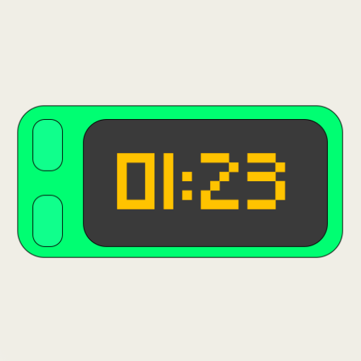

  

<h1 align="center">Timey for Home Assistant</h1>

  Control your <a href="https://timey.club">Timey</a> public transit countdown display from Home Assistant.

  

---

## What is Timey?

[Timey](https://timey.club) is a small display that shows a live countdown to your next bus, tram, train, or ferry departure. It sits on your wall or desk and shows exactly how many minutes until you need to leave.

This integration lets you control your Timey device directly from Home Assistant over your local network. No cloud, no external services.

## Features

| Entity | Type | Description |
|--------|------|-------------|
| **Display** | Light | Turn the display on/off and control brightness |
| **Stop code 1 & 2** | Text | Set which public transit stop to show |
| **Walk time 1 & 2** | Number | How many seconds it takes to walk to the stop (0-3600) |
| **Display mode** | Select | Switch between "Countdown" (5 min) and "Departure times" (14:35) |
| **Screen rotation** | Select | Flip the display (Normal / Flipped) |
| **Smart departure** | Switch | Show first reachable departure vs all upcoming |
| **Schedule** | Switch | Enable/disable the daily on/off schedule |

### Schedule & manual control

The schedule and manual on/off control are **mutually exclusive**:

- **Schedule ON** &rarr; The display follows its configured daily schedule. Turning the light on/off will show an error: *"Schedule is active. Turn off the Schedule switch first."*
- **Schedule OFF** &rarr; You can freely turn the display on/off via the light entity.

Use the **Schedule switch** to toggle between the two modes.

## Installation

### HACS (recommended)

1. Open HACS in Home Assistant
2. Click the three dots menu &rarr; **Custom repositories**
3. Add `https://github.com/MaxGramser/timey-homeassistant-hacs` with category **Integration**
4. Click **Install**
5. Restart Home Assistant

### Manual

1. Copy the `custom_components/timey` folder to your Home Assistant `config/custom_components/` directory
2. Restart Home Assistant

## Setup

After installation, your Timey device should be **automatically discovered** via Zeroconf (mDNS). You'll see a notification in Home Assistant asking to set it up.

If auto-discovery doesn't work:

1. Go to **Settings** &rarr; **Devices & Services** &rarr; **Add Integration**
2. Search for **Timey**
3. Enter the IP address of your Timey device

## Requirements

- Timey device running firmware **5.0.0** or later (includes the local REST API)
- Device must be on the same local network as Home Assistant

## How it works

The integration communicates with the Timey device over a local REST API (port 80). It polls the device state every 10 seconds. All communication stays on your local network.

## Troubleshooting

**Device not discovered automatically?**
- Make sure the Timey is connected to the same network as Home Assistant
- Try adding it manually using the IP address (check your router for the device IP)

**"Schedule is active" error when turning on/off?**
- This is expected. Turn off the Schedule switch first, then you can control the display manually.

**Entity shows "unavailable"?**
- The device might be offline or unreachable. Check if the Timey is powered on and connected to WiFi.
